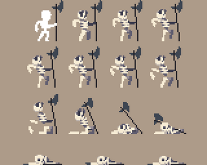
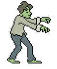
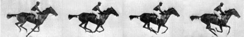
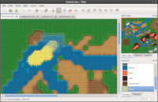
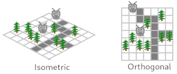
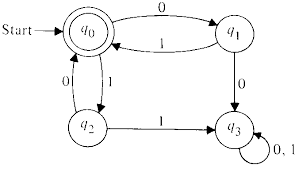

# JASGL - Java AWT/Swing Game Library


Game Library purely written in Java by using AWT/Swing canvas rendering.
No external native libraries are used.

Start your game loop with a one liner (title, window size, background color).
This hides the following complexity: game loop thread, double-buffered 30 FPS active rendering on canvas, swing keyboard and mouse input processing and
Swing frame setup.
```java
GameLoopFrame.loop("Game Demo", 800, 450, Color.black, new MyGame());
```

Concentrate on your game containing the three major aspects:
input handling, game state update and rendering which is called each frame of 30 frames in a second.
```java
//hello world game
public class MyGame implements Game {

    private GameLoop gameLoop;

    /**
     * Store your game state using class attributes here.
     */

    /**
     * To access the game loop and change some aspects.
     * E.g.: use gameLoop.close() to close the game.
     */
    @Override
    public void init(GameLoop gameLoop) {
        this.gameLoop = gameLoop;
    }

    /**
     * Decide for a frame how input changes your game state.
     */
    @Override
    public void input(Keyboard keyboard, Mouse mouse) {
        //close when escape is pressed
        if (keyboard.pressed(KeyEvent.VK_ESCAPE)) {
            gameLoop.close();
            return;
        }
    }

    /**
     * Update the game state when given milliseconds are elapsed.
     */
    @Override
    public void update(double ms) {

    }

    /**
     * Render the frame of the current game state.
     */
    @Override
    public void render(Graphics2D g) {

    }

}
```

## Using JASGL

Below some sections about game making and usage of this library.
If you have special requirements and can not reuse implemented classes,
it should always be possible to extend a library class.

### Load Images


Usually games need images.
Put your images in maven's `/src/main/resources` folder and load the images in your
Game class.
This ensures that your images are shipped with the built jar.

```java
import javax.imageio.ImageIO;
import java.awt.Image;

private static final Image sprite1;
static {
    try {
        sprite1 = ImageIO.read(MyGame.class.getResourceAsStream("/path/to/sprite1.png"));
    } catch (IOException ex) {
        throw new RuntimeException(ex);
    }
}
```

If you need to access the image by attribute name, you could use reflection.
```java
public static Image getImageByName(String name) {
    try {
        Field f = MyGame.class.getDeclaredField(name);
        return (Image) f.get(null);
    } catch (Exception ex) {
        throw new RuntimeException(ex);
    }
}
```

### Sprite Sheet



Skeleton-pack by [jesse-m.itch.io](https://jesse-m.itch.io/skeleton-pack)

Sprite sheets are used to put many images of a sprite into one image.
But then we have to state where the subimages are and what they animate.
A `SpriteSheet` gives a sequence of subimages a name (e.g. "killed" are the images where the skeleton collapses).

* *`SpriteSheet`* a sheet of image sprites.
  * `RpgMakerCharSpriteSheet` in rpg maker 8 character are in one sprite. This class automatically and correctly cuts the
    subimages.

### Sprite



* *`Sprite`* is a moveable object in the game. Thus, it basically has a position. It is updatable and renderable.
  * `DummySprite` renders just a black rectangle.
  * `SpriteSheetSprite` is a sprite that uses a `SpriteSheet` and an `Animator` to present its
    appearance using animated sequence of images.
    * `RpgMakerCharSprite` is a rpg marker character sprite. You have to state the character index because
    in one sprite 8 character are present. The animator is given with a configured `SequentialFixedIntervalFrameAnimator`.
* `ListOfSprites` is a (array-)list of sprites with additional list based operations on sprites.

#### Interfaces

Sprites can implement interfaces when they have certain behavior.

* *`Pivotable`*: sprites have a direction (left,up,right,down) which can be changed. This can be used by a `Positioner`.


### Animator



An animator changes image frames to create an animation.

* *`Animator`*
  * *`FrameAnimator`* is an animator that changes frames (int).
    * `SequentialFixedIntervalFrameAnimator` is an frame animator that changes frames in a fixed time interval and in a given sequence (e.g. 1,5,2,4).

### Positioner


A positioner moves `Sprite`s in the game, maybe based on input.

* *`Positioner`* changes positions of given sprites. Can also start and stop animation based on positioning (e.g. walking).
  * `RpgMakerCharPositioner` works like the one implemented in rpg maker. Moves the character left,up,right,down
     in a grid. While walking the correct animation of a `RpgMakerCharSprite` is played.

### Map



A map (or level) is the world where your sprites will be placed.
Building a map is easier with an editor where you can "draw" your levels.
I recommend to use [Tiled](https://www.mapeditor.org/) a map editor for tile-based maps.

#### Tileset


Like a spritesheet is a set of sprites, a tileset is a set of tiles (building blocks).
You "draw" the map by reusing and arranging the tiles to create an interesting level.
In [Tiled](https://www.mapeditor.org/) you can load tileset images and create a tileset (has file extension `*.tsx`).
The tileset is XML-based and stores a relative path to the image file.
Individual tiles can have string, int, float, boolean, file and color typed key-value-based properties.

#### Map with Layers

[Tiled](https://www.mapeditor.org/) allows you to create a map (file extension `*.tmx`) with multiple tile layers.
This map format is also XML-based and stores relative paths to tilesets.
One layer can use multiple tilesets.



Usually, one of the two perspectives are used to render a map: isometric or orthogonal.

#### Objects

There are object layers that contain a set of objects instead of tiles.
This can be used to define where sprites should be placed or events should be triggered.

#### Maps in JASGL

[Tiled](https://www.mapeditor.org/) has a library called [libtiled](https://mvnrepository.com/artifact/org.mapeditor/libtiled) to read and render maps in Java.
JASGL uses this library and adds some utlity functions. In order to avoid name clashes with `Map` we call the
base class in JASGL `LevelMap`.

* *`LevelMap`* is the base class of all maps and just states that is can be rendered layer-wise. If you want to create your own map,
you can inherit from this class.
  * `TiledOrthogonalLevelMap` represents an orthogonal map created by [Tiled](https://www.mapeditor.org/) map editor.

```java
public MyGame() {
    TiledOrthogonalLevelMap lvl01 = new TiledOrthogonalLevelMap(new File("/path/to/lvl01.tmx"));
    //or from maven's src/main/resources
    //TiledOrthogonalLevelMap lvl01 = new TiledOrthogonalLevelMap("/resource/path/to/lvl01.tmx");

    //access map data
    TileLayer foreground = lvl01.getTileLayerByName("foreground");
    ObjectGroup npcs = lvl01.getObjectGroupByName("NPCs");
    MapObject enemy01 = lvl01.getMapObjectByName(npcs, "enemy01");
}

@Override
public void render(Graphics2D g) {
    //render all layers
    lvl01.render(null, g);
    //or render layer-wise
    lvl01.render("background", g);
    //here: render something in between the layers
    lvl01.render("foreground", g);
}
```

### Game States



When you have more than one game state you can use the `GameMultiplexer` class.
This is helpful when you want to switch between menu and gameplay, for example.

* `GameMultiplexer` manages multiple games and let them switch between them.
   Because `GameMultiplexer` extends `Game` you could structure them recursively.
   `GameState`s can also instantiate new games on demand.
* *`Game`*: the basic game class with the three major aspects: input handling, game state update and rendering.
  * *`GameState`* also adds methods for accessing `GameMultiplexer` as well as entering and leaving the state.

Example usage of the `GameMultiplexer`:
```java
GameMultiplexer gameMultiplexer = new GameMultiplexer();
gameMultiplexer.addGame("1", new GameState1());
gameMultiplexer.addGame("2", new GameState2());
gameMultiplexer.switchTo("1");

GameLoopFrame.loop("Multi Game Demo", 800, 450, Color.white, gameMultiplexer);
```

```java
private class GameState1 implements GameState {

    private GameLoop gameLoop;
    private GameMultiplexer gameMultiplexer;

    @Override
    public void init(GameMultiplexer gameMultiplexer) {
        this.gameMultiplexer = gameMultiplexer;
    }

    @Override
    public void init(GameLoop gameLoop) {
        this.gameLoop = gameLoop;
    }

    @Override
    public void enter(String predecessorName, Game predecessor) {
        //when entering this game state
    }

    @Override
    public void leave(String successorName, Game successor) {
        //before leaving this game state
    }

    @Override
    public void input(Keyboard keyboard, Mouse mouse) {
        //switch to second game state when right arrow is pressed
        if(keyboard.pressed(KeyEvent.VK_RIGHT)) {
            gameMultiplexer.switchTo("2");
        }
        //close game when escape is pressed
        if(keyboard.pressed(KeyEvent.VK_ESCAPE)) {
            gameLoop.close();
        }
    }

    //(...)
}

private class GameState2 implements GameState {
    //(...)
}
```
